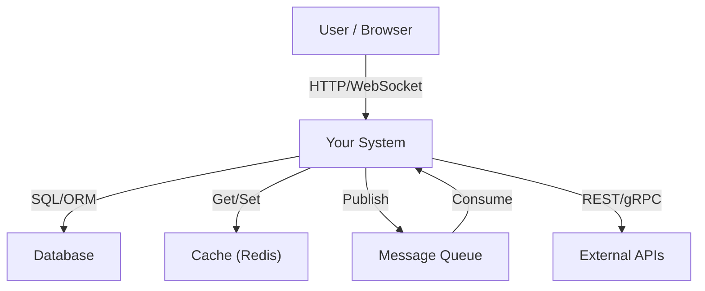
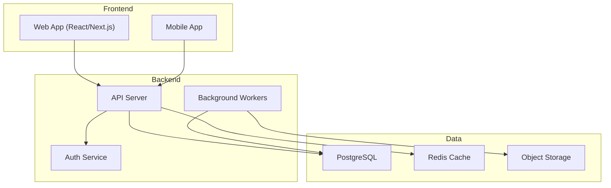
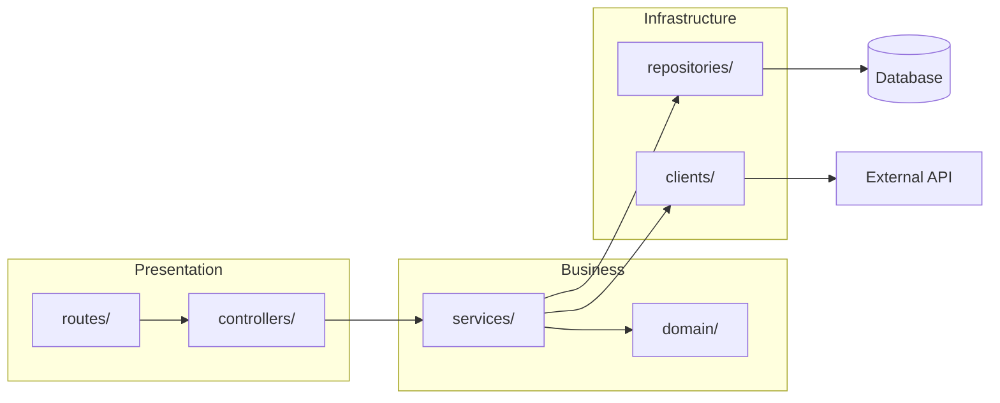

# Architecture from Code

## Overview

Read the actual codebase. Generate accurate architecture diagrams. No guessing, no outdated docs — diagrams that reflect what the code ACTUALLY does right now.

## When to Use

- "Document this project's architecture"
- "Show me the dependency graph"
- "Generate a C4 diagram of this system"
- "What services talk to each other?"
- "Map out the data flow"
- Onboarding onto an unfamiliar codebase
- Architecture review before major refactoring
- Generating ADRs (Architecture Decision Records)

## Quick Start

```bash
# Step 1: Identify the codebase structure
find . -name "*.ts" -o -name "*.py" -o -name "*.go" | head -50
# Or: list top-level directories
ls -la src/ app/ lib/ services/ packages/

# Step 2: Run this skill's analysis process (below)
# Step 3: Output Mermaid diagram
```

## Process

### Step 1: Discover Project Shape

```bash
# Package manager = tech stack signal
ls package.json pyproject.toml go.mod Cargo.toml pom.xml *.csproj 2>/dev/null

# Entry points
ls src/index.* src/main.* app/main.* cmd/main.* 2>/dev/null

# Service boundaries (microservices)
ls -d services/* apps/* packages/* 2>/dev/null

# Configuration reveals integrations
cat .env.example docker-compose.yml 2>/dev/null | grep -i "host\|url\|port\|database\|redis\|queue"
```

### Step 2: Trace Dependencies

**For TypeScript/JavaScript:**
```bash
# External dependencies = integration points
cat package.json | jq '.dependencies' 
# Internal imports = module relationships
grep -r "from ['\"]\.\./" src/ --include="*.ts" | sed 's/.*from ['\''\"]\(.*\)['\''\"]/\1/' | sort | uniq -c | sort -rn
```

**For Python:**
```bash
cat requirements.txt pyproject.toml | grep -v "^#"
grep -r "^from\|^import" src/ --include="*.py" | grep -v __pycache__ | sort | uniq -c | sort -rn
```

**For Go:**
```bash
cat go.mod | grep -v "^//"
grep -r "import" . --include="*.go" | grep -v vendor | sort | uniq -c | sort -rn
```

### Step 3: Identify Layers & Boundaries

Read top-level directories and classify:

| Directory Pattern | Likely Layer | Diagram Element |
|-------------------|-------------|-----------------|
| `api/`, `routes/`, `controllers/` | Presentation | API Gateway box |
| `services/`, `usecases/`, `domain/` | Business Logic | Core services |
| `repositories/`, `db/`, `models/` | Data Access | Database cylinder |
| `lib/`, `utils/`, `shared/` | Infrastructure | Shared component |
| `workers/`, `jobs/`, `queues/` | Background Processing | Async workers |
| `events/`, `pubsub/`, `messaging/` | Event Bus | Message broker |

### Step 4: Generate Diagrams

**System Context (C4 Level 1):**


**Container Diagram (C4 Level 2):**


**Dependency Flow:**


### Step 5: Generate Documentation

Output a structured architecture doc:

```markdown
# Architecture Overview

## System Context
[Mermaid diagram here]

## Key Decisions
- **Framework:** [detected] because [inferred from config]
- **Database:** [detected from connection strings]
- **Caching:** [detected from Redis/Memcached usage]
- **Deployment:** [detected from Dockerfile/k8s/serverless config]

## Data Flow
1. Request enters via [entry point]
2. Auth validated by [auth middleware/service]
3. Business logic in [service layer]
4. Data persisted to [database]
5. Response returned via [serialization layer]

## Integration Points
| System | Protocol | Purpose |
|--------|----------|---------|
| [external service] | REST/gRPC | [inferred purpose] |

## Scaling Considerations
- [Based on queue usage, caching patterns, etc.]
```

## Verification

After generating diagrams, verify:
- [ ] Every service in the diagram exists in the code
- [ ] Every arrow represents an actual import/call/connection
- [ ] No phantom components (things in the diagram that aren't in code)
- [ ] Database connections match actual config
- [ ] External integrations match env vars / client code

## Common Mistakes

- Drawing desired architecture instead of ACTUAL architecture (read the code, not the wiki)
- Missing background workers / cron jobs (they're often in separate dirs)
- Forgetting env-var-driven integrations (read .env.example)
- Over-abstracting (show actual services, not "microservice architecture")
- Not checking docker-compose.yml (reveals ALL infrastructure dependencies)
- Ignoring test files (they reveal integration points via mocks)

## Output Formats

| Format | Use When |
|--------|----------|
| **Mermaid** | Default — renders in GitHub, Notion, most tools |
| **PlantUML** | Enterprise teams, existing PlantUML tooling |
| **C4 (Structurizr)** | Formal architecture reviews |
| **ASCII** | Terminal/CLI environments |
| **Excalidraw JSON** | When user wants editable hand-drawn style |
