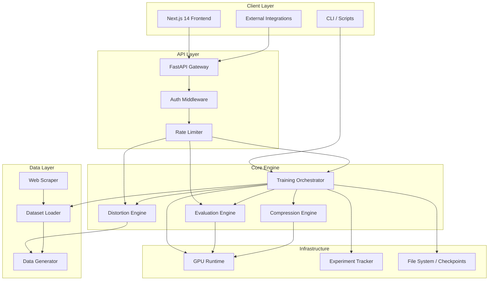
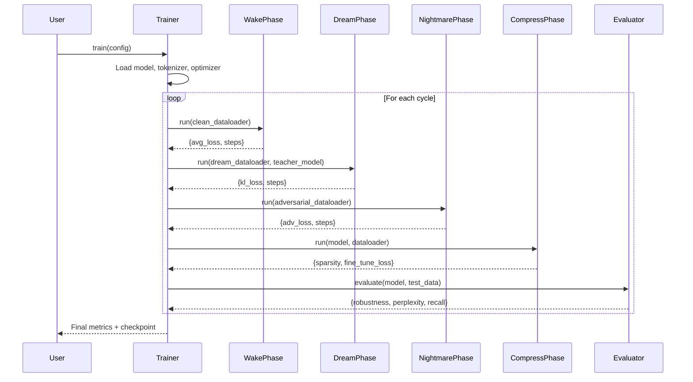
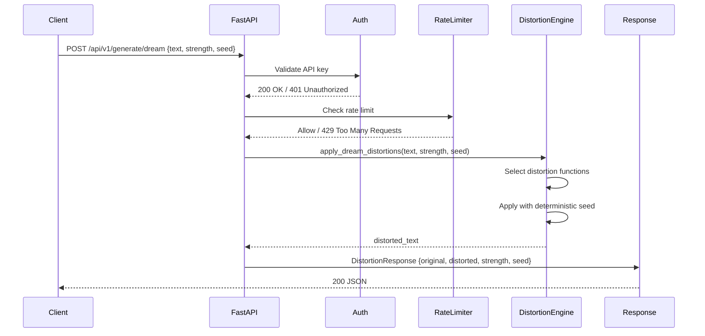
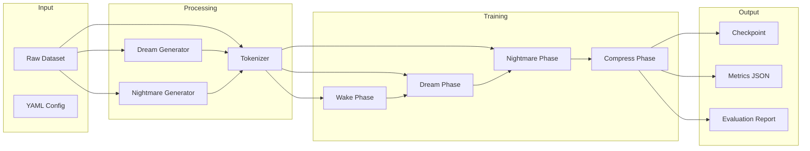
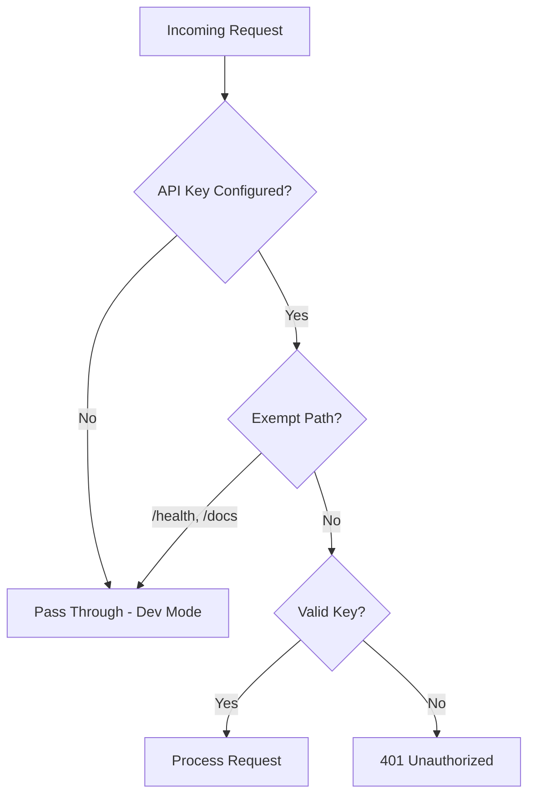
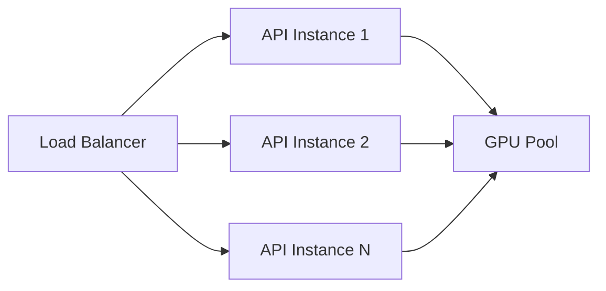
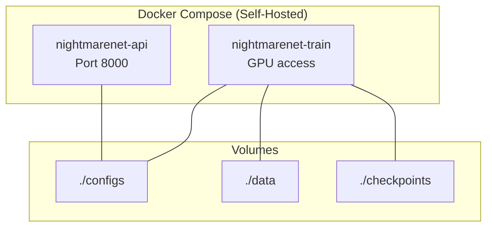
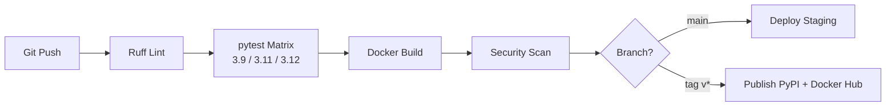
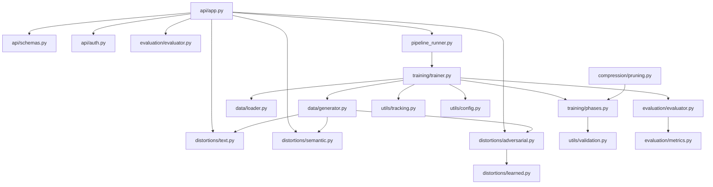

# NightmareNet — Technical Requirements Document (TRD)

**Version**: 1.0
**Last Updated**: 2026-05-23
**Status**: Draft
**Owner**: NightmareNet Core Team

---

## 1. System Architecture

### 1.1 High-Level Architecture



### 1.2 Training Pipeline Architecture



---

## 2. Technology Stack

| Layer | Technology | Version | Justification |
|-------|-----------|---------|---------------|
| Language | Python | 3.9+ | ML ecosystem standard; broad library support |
| ML Framework | PyTorch | ≥2.0 | Dynamic graphs, AMP support, dominant in research |
| Model Library | Transformers (HF) | ≥4.35 | Pre-trained model access, tokenizer infrastructure |
| API Framework | FastAPI | ≥0.100 | Async, OpenAPI auto-docs, Pydantic validation |
| Validation | Pydantic | v2 | Type-safe request/response, JSON Schema generation |
| Rate Limiting | slowapi | ≥0.1.9 | Lightweight, FastAPI-native, no external deps |
| Frontend | Next.js | 14 | App Router, RSC, production-ready React framework |
| Styling | Tailwind CSS | v4 | Utility-first, `@theme inline` for design tokens |
| Animation | Framer Motion | ≥10 | Declarative animations, layout transitions |
| Experiment Tracking | W&B / TensorBoard | Optional | Industry standard; abstracted behind interface |
| Linting | Ruff | ≥0.4 | Fast, replaces flake8+isort+pyupgrade |
| Testing | pytest | ≥7.0 | Fixtures, parametrize, rich assertion introspection |
| CI/CD | GitHub Actions | — | Native GitHub integration, matrix builds |
| Containerization | Docker | 20.10+ | Reproducible environments, multi-stage builds |

---

## 3. Architecture Principles

### P1: Phase Isolation

Each training phase (Wake, Dream, Nightmare, Compress) is an independent class with a single `run()` method. Phases share no mutable state except the model reference. This enables independent testing, phase reordering, and future parallelization.

### P2: Configuration-Driven Behavior

All runtime behavior is determined by YAML configuration with sensible defaults. No hardcoded hyperparameters, model names, or paths. Config schema is validated at load time with clear error messages.

### P3: Graceful Degradation for Optional Dependencies

Optional features (W&B, Accelerate, learned adversarial models) are guarded behind `try/except` imports. The system operates at reduced capability rather than crashing when optional dependencies are missing.

### P4: API-First Design

Every core capability is accessible through the REST API. The CLI and frontend are clients of the same API surface. This enables integration into arbitrary workflows without coupling to NightmareNet's UI.

### P5: Composable Evaluation

Metrics are independent functions that can be composed into evaluation suites via config. New metrics are added by implementing a function signature and registering in the evaluator — no class hierarchy changes needed.

### P6: Resource-Aware Execution

Training adapts to available hardware: AMP on CUDA, gradient checkpointing for low-VRAM, streaming for large datasets, CPU fallback for inference-only. The same config runs on a 4GB laptop GPU and an 8xA100 cluster.

### P7: Reproducibility by Default

Fixed seeds propagate through all stochastic operations. Configs fully specify an experiment. Checkpoint format includes optimizer state, scheduler state, and RNG state for exact resume.

---

## 4. Component Descriptions

### 4.1 Training Orchestrator (`nightmarenet/training/trainer.py`)

**Responsibility**: Orchestrates the complete training lifecycle — model initialization, phase sequencing, checkpoint management, early stopping, and experiment tracking integration.

**Key interfaces**:
- `Trainer.__init__(config)` — Loads model, tokenizer, optimizer, scheduler
- `Trainer.train()` — Executes configured number of sleep cycles
- `Trainer._tokenize_dataset()` — Prepares data for phase consumption

### 4.2 Phase Runners (`nightmarenet/training/phases.py`)

**Responsibility**: Execute individual training phases with isolated logic.

| Phase | Purpose | Loss Function |
|-------|---------|---------------|
| WakePhase | Supervised fine-tuning on clean data | Cross-entropy (causal LM shift) |
| DreamPhase | Knowledge consolidation via distorted replay | KL divergence vs. teacher logits |
| NightmarePhase | Adversarial hardening | Cross-entropy on adversarial examples |
| CompressionPhase | Parameter reduction + retention fine-tuning | Cross-entropy post-pruning |

### 4.3 Distortion Engine (`nightmarenet/distortions/`)

**Responsibility**: Generate perturbed text at configurable strength levels for both dream (benign augmentation) and nightmare (adversarial attack) phases.

| Module | Distortion Type |
|--------|----------------|
| `text.py` | Word shuffle, character noise, random deletion |
| `semantic.py` | Paraphrase, synonym replacement, abstraction |
| `adversarial.py` | Token replacement, semantic negation, entity swap |
| `learned.py` | MLM-based adversarial generation (optional) |

### 4.4 Evaluation Engine (`nightmarenet/evaluation/`)

**Responsibility**: Compute standardized metrics across distortion strengths, generate reports, and compare model versions.

- `metrics.py` — Individual metric functions (perplexity, robustness, recall, hallucination)
- `evaluator.py` — Orchestrator that runs configured metric suite, produces reports
- `glue.py` — GLUE benchmark integration for standard NLU evaluation

### 4.5 Compression Engine (`nightmarenet/compression/pruning.py`)

**Responsibility**: Reduce model size while preserving learned robustness.

- `MagnitudePruner` — Zeros weights below percentile threshold
- `InformationBottleneck` — Inserts dimensionality-reducing layers
- Post-compression fine-tuning loop for knowledge retention

### 4.6 Data Pipeline (`nightmarenet/data/`)

**Responsibility**: Load, process, augment, and stream datasets to training phases.

- `loader.py` — Hugging Face dataset loading with streaming support
- `generator.py` — Dream/Nightmare dataset generation via distortion engine
- `scraper.py` — Web scraping for custom dataset creation
- `ingest.py` — Data ingestion and preprocessing pipeline

### 4.7 API Layer (`nightmarenet/api/`)

**Responsibility**: REST interface for all platform capabilities with auth, rate limiting, and validation.

- `app.py` — FastAPI application, route definitions, middleware stack
- `schemas.py` — Pydantic request/response models
- `auth.py` — API key middleware with configurable enforcement

### 4.8 Pipeline Runner (`nightmarenet/pipeline_runner.py`)

**Responsibility**: Manage long-running training pipelines with lifecycle control (start, status, cancel) and bounded concurrency.

### 4.9 Frontend (`frontend/`)

**Responsibility**: Web dashboard for interactive distortion demo, pipeline monitoring, and evaluation visualization.

- Next.js 14 App Router with Server Components
- Cyberpunk dark theme (void/dream/nightmare/neural color palette)
- TypeScript API client in `src/lib/api.ts`

---

## 5. Data Flow

### 5.1 Distortion Request Lifecycle



### 5.2 Training Pipeline Data Flow



---

## 6. API Design

### 6.1 Conventions

| Aspect | Convention |
|--------|-----------|
| Base Path | `/api/v1/` |
| Versioning | URL path prefix (`/v1/`, `/v2/`) |
| Content Type | `application/json` (request and response) |
| Authentication | `X-API-Key` header (optional in dev, required in prod) |
| Rate Limiting | `X-RateLimit-Limit`, `X-RateLimit-Remaining`, `Retry-After` headers |
| Error Format | `{"detail": "message", "status_code": 4xx/5xx}` |
| Pagination | Not applicable (no list endpoints in v1) |
| Idempotency | Distortion endpoints are idempotent given same `{text, strength, seed}` |

### 6.2 Endpoint Summary

| Method | Path | Rate Limit | Auth Required |
|--------|------|-----------|---------------|
| GET | `/api/v1/health` | None | No |
| POST | `/api/v1/generate/dream` | 10/min | Yes (if configured) |
| POST | `/api/v1/generate/nightmare` | 10/min | Yes (if configured) |
| POST | `/api/v1/evaluate/robustness` | 5/min | Yes (if configured) |
| POST | `/api/v1/pipeline/create` | 2/min | Yes |
| GET | `/api/v1/pipeline/{id}/status` | 30/min | Yes |
| DELETE | `/api/v1/pipeline/{id}` | 5/min | Yes |
| POST | `/api/v1/upload/dataset` | 5/min | Yes |
| POST | `/api/v1/config/preview` | 20/min | Yes |

### 6.3 Error Handling

```json
{
  "detail": "Rate limit exceeded. Retry after 45 seconds.",
  "status_code": 429,
  "headers": {
    "Retry-After": "45",
    "X-RateLimit-Limit": "10",
    "X-RateLimit-Remaining": "0"
  }
}
```

Standard HTTP status codes:
- `200` — Success
- `400` — Validation error (malformed request)
- `401` — Authentication required/failed
- `404` — Resource not found
- `422` — Unprocessable entity (valid JSON, invalid semantics)
- `429` — Rate limited
- `500` — Internal server error
- `503` — Service unavailable (GPU busy, model loading)

---

## 7. Security Architecture

### 7.1 Authentication



- **Mechanism**: `X-API-Key` header validated against `NIGHTMARENET_API_KEY` env var
- **Dev mode**: Auth disabled when env var unset (with startup warning)
- **Exempt paths**: `/api/v1/health`, `/docs`, `/openapi.json`

### 7.2 Input Validation

- All request bodies validated via Pydantic v2 models
- String length limits on text inputs (max 10,000 chars)
- Numeric range validation (strength: 0.0–1.0)
- Seed values validated as positive integers
- File uploads: type checking, size limits (50MB default)

### 7.3 Transport Security

- TLS 1.2+ enforced at reverse proxy / load balancer level
- HSTS headers in production
- No sensitive data in URL parameters

### 7.4 Secret Management

- All secrets via environment variables
- No hardcoded credentials in source
- `.env` files excluded from version control (`.gitignore`)
- Production: cloud secret managers (Azure Key Vault / AWS Secrets Manager)

### 7.5 Dependency Security

- Dependabot/Snyk automated scanning in CI
- Pinned dependency versions in `pyproject.toml`
- Regular audit of transitive dependencies

---

## 8. Scalability Strategy

### 8.1 Horizontal API Scaling



- API is stateless — scales via container replicas behind load balancer
- Pipeline state stored in bounded in-memory registry (per-instance)
- Shared pipeline state requires Redis/PostgreSQL (hosted platform v2)

### 8.2 Training Scalability

| Strategy | Trigger | Implementation |
|----------|---------|----------------|
| Mixed Precision (AMP) | Default on CUDA | `torch.amp.autocast` + `GradScaler` |
| Gradient Checkpointing | VRAM < 8GB | `model.gradient_checkpointing_enable()` |
| Streaming Datasets | Dataset > RAM | HuggingFace `streaming=True` + IterableDataset |
| Gradient Accumulation | Effective batch > memory batch | Configurable accumulation steps |
| DDP (future) | Multi-GPU available | `torch.nn.parallel.DistributedDataParallel` |

### 8.3 Caching Strategy

| Cache Layer | Data | TTL | Eviction |
|-------------|------|-----|----------|
| Distortion Cache | `hash(text+strength+seed) → result` | 1 hour | LRU |
| Model Cache | Loaded model weights | Session | Manual unload |
| Tokenizer Cache | HF tokenizer instances | Permanent | Never |
| Pipeline Registry | Active/completed runs | Configurable | Completed-first eviction |

### 8.4 Queue Strategy (Hosted Platform)

- Pipeline creation enqueues training jobs
- Workers pull from queue and execute on GPU pool
- Status polling via registry lookup
- Dead letter queue for failed pipelines with retry policy

---

## 9. Deployment Architecture

### 9.1 Environments

| Environment | Purpose | Infrastructure |
|-------------|---------|----------------|
| Local Dev | Developer workstation | Python venv, single GPU (RTX 3050 Ti) |
| CI | Automated testing | GitHub Actions (CPU-only, no GPU tests) |
| Staging | Pre-production validation | Docker Compose, single node |
| Production (OSS) | Self-hosted by users | Docker image, user-provided GPU |
| Production (Hosted) | SaaS platform | Kubernetes, GPU node pool, LB |

### 9.2 Container Architecture



### 9.3 CI/CD Pipeline



- **Trigger**: Push to main, pull requests, version tags
- **Matrix**: Python 3.9, 3.11, 3.12 on ubuntu-latest
- **Caching**: pip dependency cache for fast installs
- **Gates**: All tests pass, lint clean, no security vulnerabilities

---

## 10. Non-Functional Specifications

### 10.1 Service Level Objectives (SLOs)

| Service | SLI | SLO | Measurement Window |
|---------|-----|-----|-------------------|
| API Availability | Successful health checks / total | 99.5% | Monthly |
| Distortion Latency | p95 response time | < 500ms | Rolling 5 min |
| Evaluation Latency | p95 response time | < 3s | Rolling 5 min |
| Training Throughput | Tokens processed per second | ≥ 80% of theoretical GPU max | Per-run |
| Error Rate | 5xx responses / total requests | < 0.1% | Hourly |

### 10.2 Performance Budgets

| Component | Budget | Measurement |
|-----------|--------|-------------|
| API Cold Start | < 5s | Time from process start to health=200 |
| Model Load | < 30s | Time to load DistilBERT on CPU |
| Frontend FCP | < 1.5s | Lighthouse First Contentful Paint |
| Frontend TTI | < 2.5s | Lighthouse Time to Interactive |
| Docker Image Size | < 2GB | Compressed image size |
| Python Package Size | < 50MB | sdist/wheel size |

### 10.3 Capacity Planning

| Resource | Single Instance | Hosted Platform (target) |
|----------|----------------|--------------------------|
| Concurrent API connections | 50 | 500 (10 replicas) |
| Active pipelines | 64 (configurable) | 256 per cluster |
| Max model size | 1B params (with checkpointing) | 7B params (A100 80GB) |
| Max dataset size | Limited by disk (streaming) | 100GB per user |
| API request throughput | 100 req/s | 1000 req/s (cluster) |

---

## 11. Technical Debt Registry

| ID | Category | Description | Severity | Planned Resolution |
|----|----------|-------------|----------|-------------------|
| TD-01 | Architecture | Pipeline state is in-memory only; lost on restart | Medium | Add persistence layer (SQLite/Redis) in v1.1 |
| TD-02 | Compatibility | `from __future__ import annotations` forbidden in API module due to Pydantic v2 bug | Low | Monitor Pydantic releases for fix |
| TD-03 | Testing | No GPU-dependent tests in CI (mock-only) | Medium | Add GPU runner to CI matrix |
| TD-04 | Security | Rate limiting is per-instance, not distributed | Low | Add Redis-backed limiter for hosted platform |
| TD-05 | Performance | Distortion engine loads models synchronously on first request | Medium | Add model preloading / warm-up on startup |
| TD-06 | Scalability | No distributed training (DDP) support yet | High | Implement in Phase 3 (multi-GPU) |
| TD-07 | Observability | No structured tracing (OpenTelemetry) | Medium | Add OTEL instrumentation for hosted platform |
| TD-08 | Frontend | No E2E tests (Playwright/Cypress) | Medium | Add E2E test suite in next sprint |
| TD-09 | Data | No data versioning (DVC integration) | Low | Evaluate DVC vs. HF datasets versioning |
| TD-10 | API | No request correlation IDs for distributed tracing | Low | Add middleware to generate/propagate trace IDs |

---

## 12. Architecture Decision Records

### ADR-001: Sleep-Inspired Phase Architecture over Monolithic Training

**Status**: Accepted
**Date**: 2026-03-15
**Context**: Need a training methodology that addresses robustness, forgetting, and compression simultaneously.
**Decision**: Implement 4 discrete phases (Wake/Dream/Nightmare/Compress) as separate classes rather than a single loss function combining all objectives.
**Consequences**:
- (+) Each phase is independently testable and configurable
- (+) Phases can be reordered, repeated, or skipped via config
- (+) Clear separation of concerns; easier to reason about
- (+) Aligns with neuroscience literature (memory consolidation during sleep)
- (-) More complex orchestration logic in Trainer
- (-) Phase transitions introduce potential information loss

### ADR-002: FastAPI over Flask/Django for API Layer

**Status**: Accepted
**Date**: 2026-03-20
**Context**: Need a Python web framework that supports async operations, auto-generates OpenAPI docs, and integrates with Pydantic for type-safe validation.
**Decision**: Use FastAPI as the API framework.
**Consequences**:
- (+) Native async support for concurrent request handling
- (+) Automatic OpenAPI/Swagger documentation
- (+) Pydantic v2 integration for request/response validation
- (+) High performance (Starlette + uvicorn)
- (-) Smaller community than Flask/Django (mitigated by rapid growth)
- (-) Pydantic v2 incompatibility with `from __future__ import annotations`

### ADR-003: In-Memory Pipeline Registry over Database-Backed Queue

**Status**: Accepted (revisit at scale)
**Date**: 2026-04-01
**Context**: Need to manage long-running training pipelines with start/stop/status semantics.
**Decision**: Use bounded in-memory dictionary with threading locks. Cap at 64 runners (configurable). Evict completed runs first when at capacity.
**Consequences**:
- (+) Zero infrastructure dependencies for self-hosted users
- (+) Simple implementation, easy to reason about
- (+) Fast status lookups (O(1) dict access)
- (-) State lost on process restart
- (-) Not shared across API replicas
- (-) Must migrate to persistent backend for hosted platform (Redis/PostgreSQL)

### ADR-004: Hybrid Open-Source + Hosted Platform Model

**Status**: Accepted
**Date**: 2026-04-10
**Context**: Need a go-to-market strategy that builds community adoption while generating revenue.
**Decision**: Apache 2.0 open-source core (distortions, training, evaluation, CLI) with proprietary hosted platform (orchestration, multi-GPU, compliance, teams).
**Consequences**:
- (+) Low barrier to adoption; academic citations drive awareness
- (+) Community contributions improve core quality
- (+) Enterprise features justify premium pricing
- (+) Compliance/audit features have clear value for paying customers
- (-) Must maintain clear boundary between OSS and paid features
- (-) Risk of competitors forking OSS core
- (-) Must deliver enough value in hosted to justify pricing

### ADR-005: Configuration-Driven over Code-Driven Experiments

**Status**: Accepted
**Date**: 2026-04-15
**Context**: Users need reproducible experiments without modifying source code.
**Decision**: All experiment parameters defined in YAML config files with schema validation. CLI accepts `--config` path. Python API accepts dict. No experiment requires code changes.
**Consequences**:
- (+) Full reproducibility via config file versioning
- (+) Non-programmers can run experiments
- (+) Config diffing shows exactly what changed between experiments
- (+) Validates at load time with clear error messages
- (-) Limited expressiveness compared to Python config (e.g., Hydra)
- (-) Complex conditional logic requires config nesting
- (-) Schema must be maintained in sync with implementation

---

## Appendix A: Module Dependency Graph



## Appendix B: Configuration Schema Reference

```yaml
model:
  name: "distilgpt2"
  type: "causal_lm"          # causal_lm | masked_lm | seq_classification
  num_labels: null            # Required for seq_classification

training:
  num_cycles: 3
  batch_size: 8
  learning_rate: 5e-5
  max_grad_norm: 1.0
  gradient_accumulation_steps: 1
  use_amp: false
  gradient_checkpointing: false
  early_stopping:
    patience: 3
    min_delta: 0.001

distortion:
  dream:
    strength: 0.3
    methods: ["paraphrase", "word_shuffle", "noise"]
  nightmare:
    strength: 0.5
    methods: ["adversarial", "semantic_negation", "entity_swap"]
  adversarial:
    learned: 0.0              # 0 = disabled
    learned_model: "distilbert-base-uncased"

compression:
  pruning_ratio: 0.2
  fine_tune_epochs: 2
  bottleneck: false

evaluation:
  metrics: ["robustness", "perplexity", "recall"]
  strengths: [0.0, 0.1, 0.2, 0.3, 0.4, 0.5, 0.6, 0.7, 0.8]

dataset:
  name: "wikitext"
  subset: "wikitext-2-raw-v1"
  split: "train"
  max_samples: null
  streaming: false
  max_length: 128

tracking:
  backend: "none"             # none | wandb | tensorboard
  project: "nightmarenet"
  log_dir: "logs/runs"

seed: 42
device: "auto"                # auto | cuda | cpu
```
